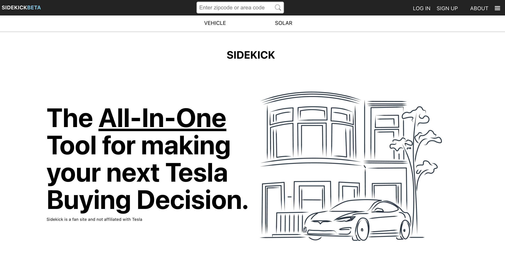
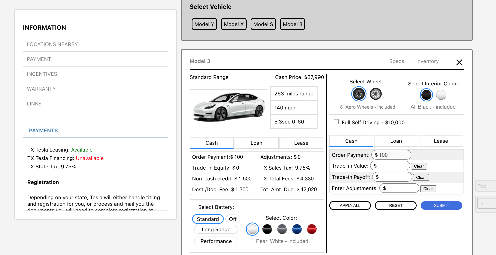
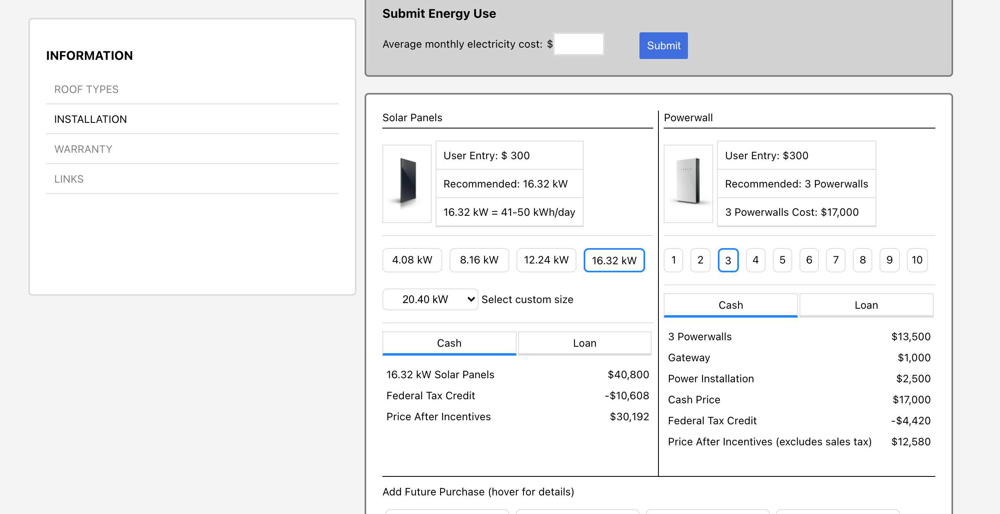
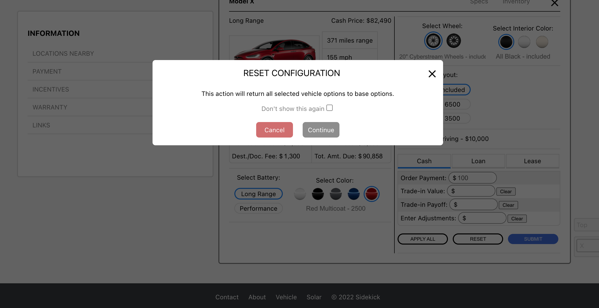

# TESLA SIDEKICK
The compact solution for your Tesla buying needs.

## HOW TO RUN THE PROJECT LOCALLY
* clone down the project
* create an .env file inside server folder (see .env.example)
* run $ npm install
* inside server folder run $ npm run dev

## Deployed
Find Sidekick running here: https://sidekick-proj.herokuapp.com/
